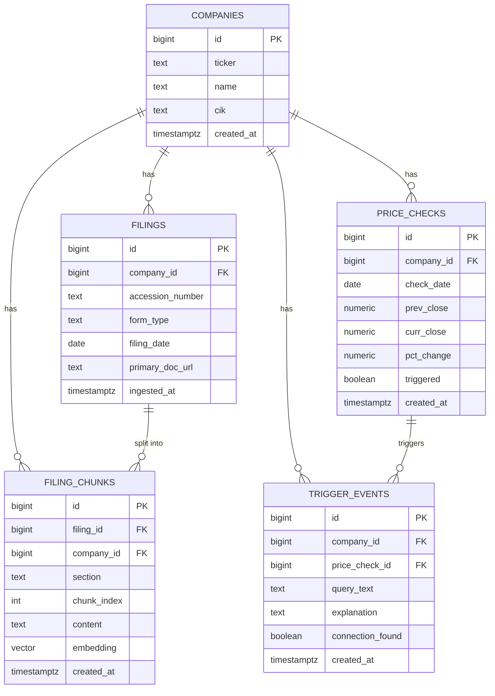

# Entity-Relationship Diagram

Generated from `db/schema.sql`. Renders automatically on GitHub and most
Markdown viewers that support Mermaid.

```mermaid
erDiagram
    COMPANIES ||--o{ FILINGS : has
    COMPANIES ||--o{ FILING_CHUNKS : has
    COMPANIES ||--o{ PRICE_CHECKS : has
    COMPANIES ||--o{ TRIGGER_EVENTS : has
    FILINGS ||--o{ FILING_CHUNKS : "split into"
    PRICE_CHECKS ||--o{ TRIGGER_EVENTS : triggers

    COMPANIES {
        bigint id PK
        text ticker
        text name
        text cik
        timestamptz created_at
    }
    FILINGS {
        bigint id PK
        bigint company_id FK
        text accession_number
        text form_type
        date filing_date
        text primary_doc_url
        timestamptz ingested_at
    }
    FILING_CHUNKS {
        bigint id PK
        bigint filing_id FK
        bigint company_id FK
        text section
        int chunk_index
        text content
        vector embedding
        timestamptz created_at
    }
    PRICE_CHECKS {
        bigint id PK
        bigint company_id FK
        date check_date
        numeric prev_close
        numeric curr_close
        numeric pct_change
        boolean triggered
        timestamptz created_at
    }
    TRIGGER_EVENTS {
        bigint id PK
        bigint company_id FK
        bigint price_check_id FK
        text query_text
        text explanation
        boolean connection_found
        timestamptz created_at
    }
```
